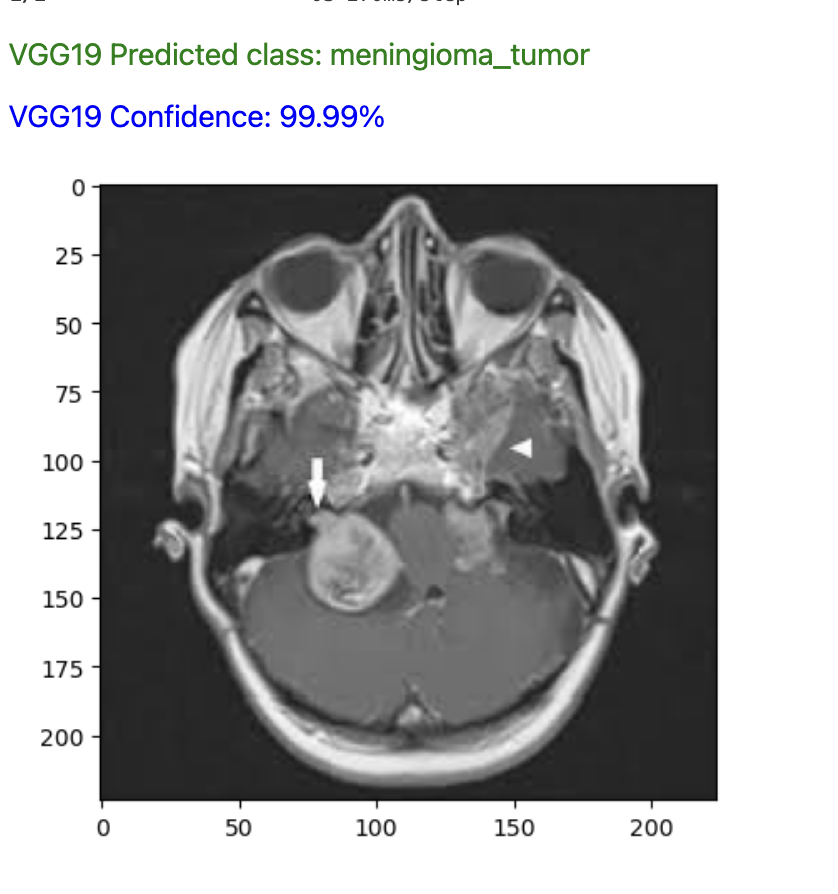

## Using Deep learning CNN models to detect and classify Brain tumors from MRI images

### Executive summary

**Project overview and goals:** 

A brain tumor is the growth of abnormal cells in the brain. The goal of brain tumor detection and classification using Convolutional Neural Networks (CNNs) is to develop an accurate and efficient mechanism for automatically identifying the presence of tumors in medical images such as MRI scans, and categorizing them into specific tumor types - meningioma, pituitary, and glioma tumor. 

Here's a breakdown of the main objectives:
Detection: The primary aim is to accurately locate and identify regions within medical images that contain tumors. This involves segmenting the tumor area from the surrounding healthy tissue.

Classification: Once the tumor regions are identified, the next step is to classify them into different categories based on their characteristics, such as size, shape, and texture. In this case, we can categories specific tumor types like gliomas or meningiomas.

Achieving high accuracy is crucial for reliable diagnosis and treatment planning of brain tumors. The CNN model should be trained on a diverse dataset of annotated medical images to learn the complex patterns and features associated with different types of brain tumors.
The CNN model should generalize well to unseen data, which means it should perform accurately on new medical images that were not part of the training dataset. This requires robust training techniques and regularization methods to prevent overfitting.

Overall, the goal is to develop a CNN-based system that can assist medical professionals in the early and accurate detection and classification of brain tumors, ultimately leading to improved patient outcomes through timely diagnosis and treatment.

**Model Evaluation and Results**

The best model for  accurately detect and classify brain tumor is the fine-tuned model using trasfer learning are EfficientNetB0 and ResNet101

Model performance can be visualized using confusion matrices and classification report which indicate the counts of each error type a model made in the classification task. 

The accuracy of EfficientNetB0 based CNN model is 93% and ResNet101 is 90%
The F1 score of EfficientNetB0 based model is 0.93 and ResNet101 is 0.9085

EfficientNetb0 often achieves comparable  accuracy to ResNet101 while requiring fewer computational resources. 
Its efficient use of parameters and improved scaling strategy contribute to its impressive performance.
It is more adaptable to small datasets, as it tends to generalize well even with limited training examples.

ResNet101 is a powerful architecture known for its strong performance especially on large-scale datasets, but it comes with higher computational costs. 
ResNet101 may struggle with overfitting when trained on small datasets due to its depth and parameter count. Additional regularization techniques or data augmentation may be necessary to prevent overfitting.

We can see that both ResNet101 and EfficientNetB0 based CCN model perform well in classifying the brain tumors based on the performance metric comparision.
The choice between the two would depends on the specific requirements which include available computational resources, and desired trade-offs between accuracy and efficiency.

EfficientNetB0 model performed the best and has the ability to accurately detect and classify brain tumors with 93% accuracy.

EfficientNetB0 model performance summary below

We can see some qualitative examples of the correct predictions made by the model that gives us insights into the model's behavior and potential areas for improvement.

**Meningioma**

**Pituitary**

**Glioma tumor**

**No Tumor**

**Results and Conclusion**

Using transfer learning with pre-trained models like DenseNet, VGG19, EfficientNetB0, and ResNet101 is a powerful approach to enhance classification accuracy, especially when dealing with complex tasks like brain 
tumor classification. Leveraging the pre-existing knowledge encoded in these models and fine-tuning them on a dataset specific to brain tumor classification, we improve the performance and achieve more accurate 
predictions.

Using the pretrained model and training it on a dataset specific to the brain tumor classfication task we can make classify and make predictions using the fine-tuned network.

EfficientNetB is chosen as the recommended model based on the evaluation to identifying and classifying brain tumors into three categories: pituitary, meningioma, and glioma, achieving an accuracy of 93%. 
This success demonstrates the effectiveness of transfer learning in addressing the challenges posed by small datasets and improving the accuracy of brain tumor detection.

By fine-tuning the pre-trained EfficientNetB0 model on a dataset tailored to brain tumor classification, clinicians can efficiently classify and make predictions regarding tumor types. This precise and rapid 
identification of tumor types can expedite treatment decisions, ultimately improving patient outcomes.

EfficientNetB0's balance between model size and accuracy makes it particularly suitable for brain tumor MRI image classification and segmentation, especially in resource-constrained environments. Its efficiency allows it to be deployed effectively even in settings with limited computational resources, making it a valuable tool for medical professionals.

**Next steps**
As next steps, I would like to experiment with different hyperparameters such as learning rate, batch size, optimizer, and regularization techniques to optimize model performance. 
I also would like to use techniques like cross-validation to evaluate the model's performance and generalize well to unseen data.

In addition, perform Data augmentation like random rotations, and intensity variations will help increase the diversity of the training data and improve the model's robustness to variations in image appearance. 
To improve the performance of the model, I would like to retrain the model with updated datasets including different brain MRI images and incorporate new models in deeplearning like Unet for effective image segmentation.

### Outline of project

[Link to notebook](./CNN_Brain_Tumor.ipynb) 

[Link to download data](https://www.kaggle.com/datasets/sartajbhuvaji/brain-tumor-classification-mri) 

